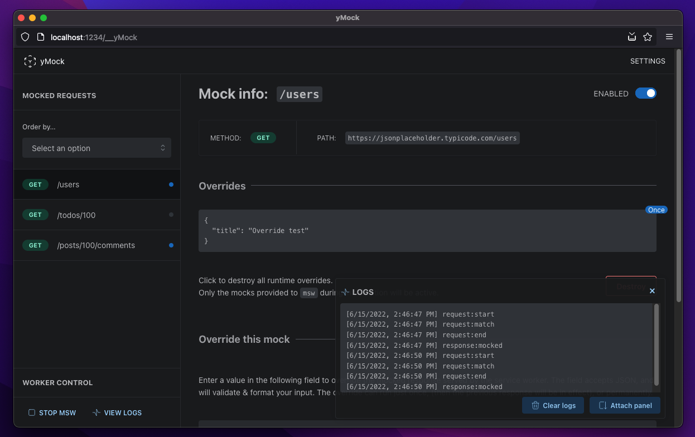
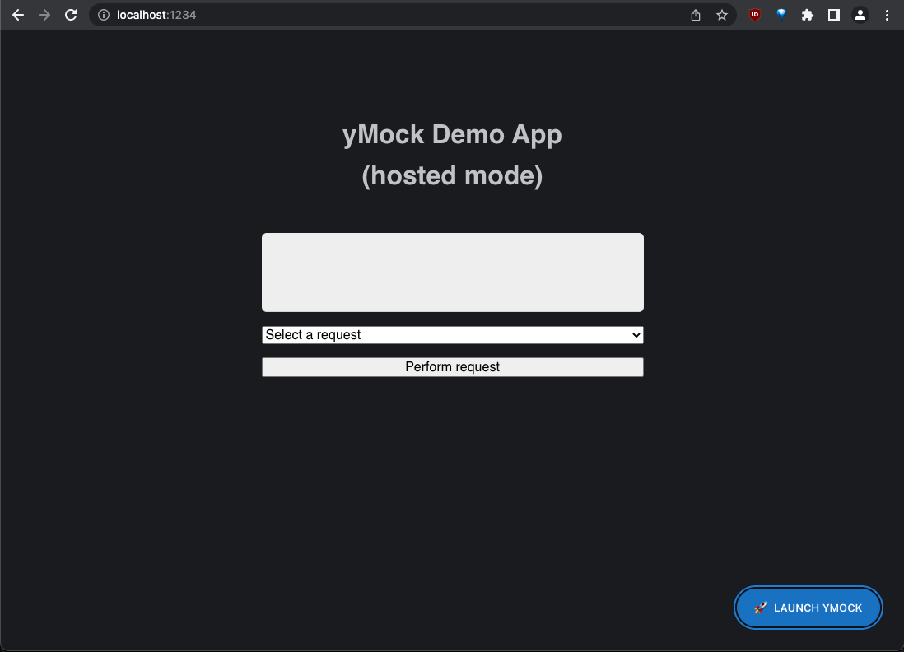

# yMock



### What is yMock?

**TL;DR:** _A full-featured management GUI for [MSW](https://mswjs.io)_

[yMock](https://github.com/intesys/ymock/) is a development tool based on [MSW](https://mswjs.io) that offers a graphic interface for the developer to manage mock data and a service worker that runs underneath. By using yMock, the developer can see the list of endpoint calls to be intercepted by the worker, change the data each one should return in the response body, and turn on/off the worker interception as a whole or in each endpoint response individually.

It is worth pointing out that, by using the service worker, the interception occurs in the network layer. Therefore the calls are listed and can be inspected in the network tab of your browser's development tools.

### What does it do?

- It presents a graphic interface that favors development experience;
- It uses a service worker to intercept API calls in the network layer;
- It lists the URLs registered by MSW to be intercepeted;
- It displays and allows the user to override the mocked response;
- It allows the user to start/stop the worker as a whole or in each URL individually.

---

## Getting started

### Monorepo structure

This project is a monorepo, managed with [TurboRepo](https://turbo.build/); here's how it's organized:

```
ymock
  |
  |__ apps
        |__ host
        |__ ymock
      docs
      packages
        |__ shared
```

- `apps`, `packages`: conventional monorepo dirs
- `host` workspace: the host app (read more later)
- `ymock` workspace: you guessed it
- `docs` workspace: documentation site (WIP)
- `shared` workspace: libraries, utilities, etc

### Development

#### Initializing the monorepo & starting the dev server

If it's the first time you use the repo, or if you just cloned it, follow this step;
otherwise, skip to the next one.

From the root of the repo, run:

```bash
npm i
```

This will install the deps and register all workspaces to the monorepo manager.
Notice that each workspace will have its own `node_modules`; plus, there'll be a
global `node_modules` at the root of the repo.

Then, run -- from the root:

```bash
turbo dev
```

This will run turbo's `dev` task, as specified in the global `package.json`;
this in turn will run the `dev` task _in all workspaces that have one_,
or just in _some_ workspaces if the script uses a filter (like `--workspace=<WORKSPACE>`).

---

#### Installing & managing deps

As a rule of thumb, use the global installation when you initially clone the repo
and if/when you do something that alters the workspace definitions for Turbo
(i.e. adding/removing workspaces, or changing the disk location of any workspace -- also see [here.](https://turbo.build/repo/docs/handbook/workspaces#managing-workspaces)).

In all other cases, run per-workspace `npm` commands with `--workspace`. For all the details, please refer to [this guide](https://turbo.build/repo/docs/handbook/package-installation).

---

#### Stand-alone yMock VS hosted yMock

yMock's use case is to manage a `msw` instance launched by a host app;
the host app could be literally any app run by the end user.

To realistically simulate this behavior, the monorepo contains a `host` app that
`import`s `ymock` as a dependency. The `host` behaves as a completely independent app.



To see yMock in action, click the "Launch yMock" launcher button.

When you need to develop yMock _without_ binding it to the host app (for example,
you may want to rapidly iterate on the UI), just visit `ymock`'s dev server
-- remember, it's a monorepo, so we're running multiple apps in parallel.

In this case, the app won't use an actual reference to `msw`, but a mock object.

---

#### Building

(WIP)
