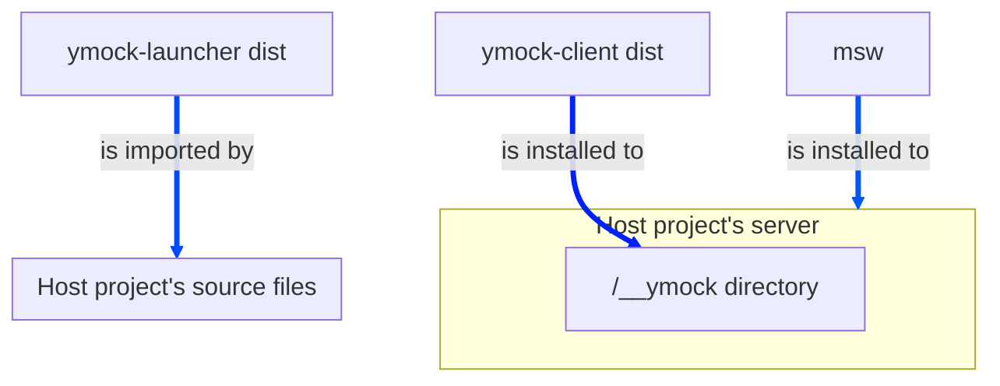
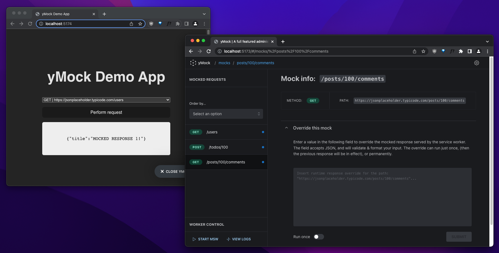

# yMock


## What is yMock?

**TL;DR:** _A full-featured management GUI for [MSW](https://mswjs.io)_

[yMock](https://github.com/intesys/ymock/) is a development tool based on [MSW](https://mswjs.io) that offers a graphic interface for the developer to manage mock data and a service worker that runs underneath. By using yMock, the developer can see the list of endpoint calls to be intercepted by the worker, change the data each one should return in the response body, and turn on/off the worker interception as a whole or in each endpoint response individually.

It is worth pointing out that, by using the service worker, the interception occurs in the network layer. Therefore the calls are listed and can be inspected in the network tab of your browser's development tools.

## What does it do?

- It presents a graphic interface that favors development experience;
- It uses a service worker to intercept API calls in the network layer;
- It lists the URLs registered by MSW to be intercepted;
- It displays and allows the user to override the mocked response;
- It allows the user to start/stop the worker as a whole or in each URL individually.

---

## Getting started

### Monorepo structure

This project is a monorepo, managed with [TurboRepo](https://turbo.build/); here's how it's organized:

```
ymock
  │
  └── apps
        ├── host
        ├── launcher
        └── ymock
      packages
        └── shared
      docs
      website
```

- `apps`, `packages`: conventional monorepo dirs
- `host` workspace: the host app (read more later), AKA `ymock-host`
- `ymock` workspace: you guessed it, AKA `ymock-client`
- `launcher` workspace: yMock's launcher UI, AKA `ymock-launcher`
- `docs` workspace: documentation site (WIP)
- `website` workspace: product website (WIP)
- `shared` workspace: libraries, utilities, etc

### Initializing the monorepo

If it's the first time you use the repo, or if you just cloned it, follow this step;
otherwise, skip to the next one.

From the root of the repo, run:

```bash
npm i
```

This will install the deps and register all workspaces to the monorepo manager.
Notice that each workspace will have its own `node_modules`; plus, there'll be a
global `node_modules` at the root of the repo.

### Installing & managing deps

As a rule of thumb, use the global installation when you initially clone the repo
and if/when you do something that alters the workspace definitions for Turbo
(i.e. adding/removing workspaces, or changing the disk location of any workspace -- also see [here.](https://turbo.build/repo/docs/handbook/workspaces#managing-workspaces)).

In all other cases, run per-workspace `npm` commands with `--workspace`. For all the details, please refer to [this guide](https://turbo.build/repo/docs/handbook/package-installation).

### Running the dev server

Before we start: yMock's use case is to manage a `msw` instance launched by a host app;
the host app could be literally any app run by the end user.

To realistically simulate this behavior, the monorepo contains a `host` app that
`import`s `ymock-launcher` as a dependency; the launcher's job is to receive the
`msw` instance and pass it to `ymock-client`, which lives in a `__ymock` directory
under the host project's root.



So, the global `dev` task will:

- Run client, launcher & host on their own dev server, in parallel
- Build launcher & client _before_ running dev on the host app
- Import launcher into host as an actual npm dependency, referencing the dist assets
- Copy the client build into host, reproducing how it should work in the context of the end user's project
- Rebuild launcher & client on any dev change, and copy client into host



Ready? Just run -- from the root:

```bash
npm run dev
```

To see yMock in action, click the **"Launch yMock"** launcher button in the host app.

#### What if I need to run just one app?

While the global `dev` command will run the `dev` task _in all workspaces that have one_,
you can also run it just in _some_ workspaces by using a filter (like `--workspace=<WORKSPACE>`).

#### Use the power of the monorepo to your advantage

When you need to rapidly iterate on ymock's UI, just visit `ymock-client`'s dev server
-- remember, it's a monorepo, so we're running multiple apps in parallel; in this case, the app won't use an actual reference to `msw`, but a mock object. The changes you make in dev are instantly reflected in the app.

---

### Building

(WIP)
