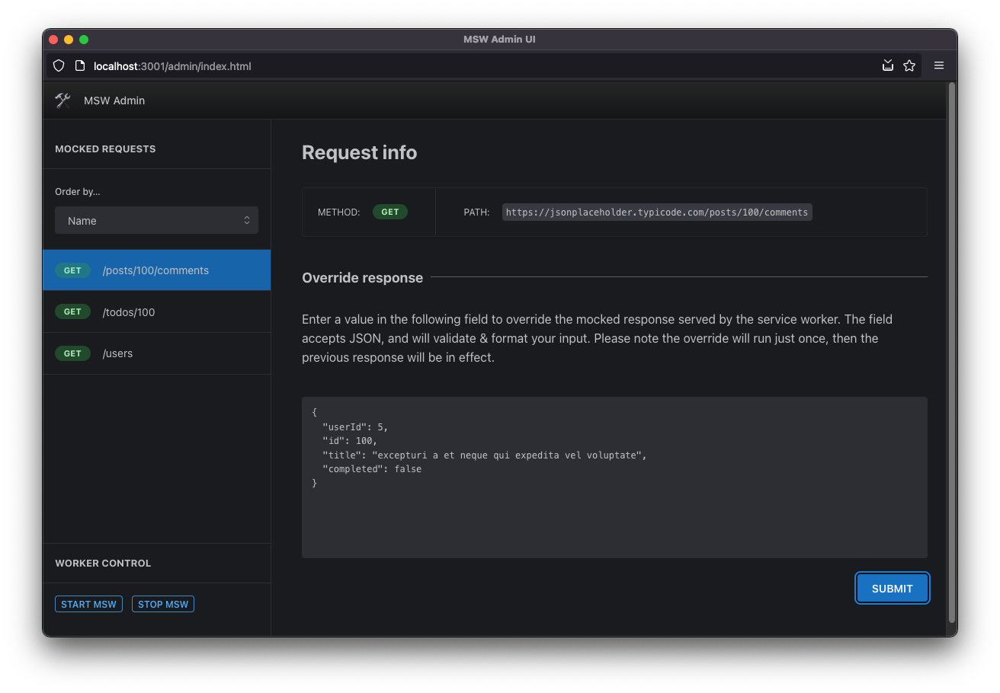

# yMock

A minimal administrative UI for [MSW.](https://mswjs.io)

### Features

- Lists the handlers (mocks) registered by MSW
- Lets you override the mocked response
- Lets you start/stop the worker

---

## Contribute

### Development

- From the root of the project, run: `yarn dev`
- The Admin UI lives at `/`, and receives the `msw` instance
- The host app (which launches the Admin UI in a new window preloaded with `msw`) lives in `/demo`

### Hosted mode (default)

This app's use case is to manage a `msw` instance launched by a host app;
This is the default behavior when you run `yarn dev`, so you'll have to launch
the app from a "demo" page rendered at `/`; if you try to run the app from
its own route (`/__${APP_NAME}`) you will get an error.

### Standalone mode

For cases when you want to develop the app
_without_ tying it to the host app (for example,
you may want to provide your own mock instance of
msw, or rapidly iterate on the UI), enable `STANDALONE_MODE` in `.env`.
This way, the msw instance required by the app will
be pre-populated locally, without needing to look
for it in the window object.

### TODO

- [x] The `/demo` route should be hidden in production
- [x] There's something not 100% working with the `__ymock` basepath
